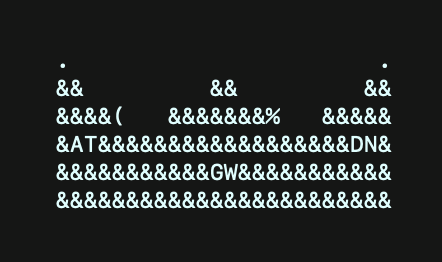

# ASCII Wonderbly Crown Logo

For all your excessive command line branding needs.

### Usage
```js
import wblyCrown from '@lostmyname/wonderbly-crown';
console.log(wblyCrown);
```

### Output example
